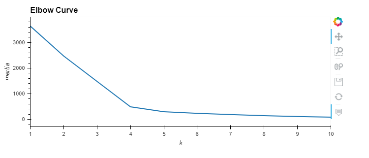
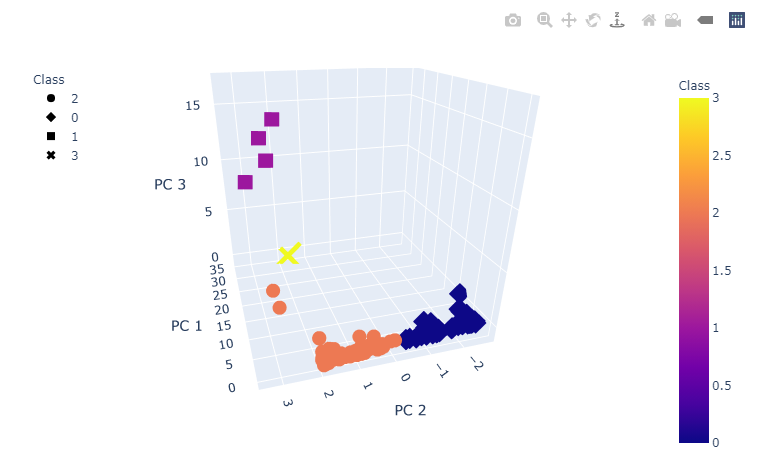
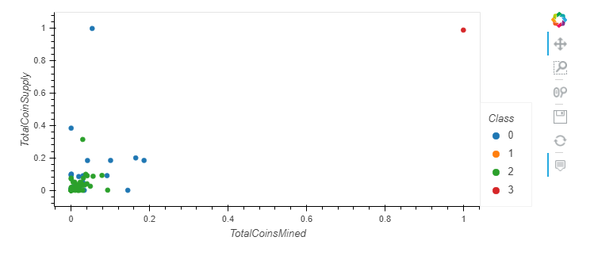

# Cryptocurrencies
Accountability Accounting, a prominent investment bank, is interested in offering a new cryptocurrency investment portfolio for its customers. The company, however, is lost in the vast universe of cryptocurrencies

## Overview

The purpose of this analysis is to utilize Unsupervised Machine Learning to group our Cryptocurrency data, by clustering our data using the K-Means Algorithm, and see if we can categorize the different Cryptocurrencies offered.

The Cryptocurrency data provides a few characteristics of the available cryptocurrencies such as: 
- The Cryptocurrency's Name
- Algorithm used
- Whether its currently trading
- Type of Blockchain/Proof Type
- Total Coins Mined
- Total Coins Supply

Using these data points, we are going to preprocess the data and reduce its data dimensions using PCA, and submit it to the K-Means Algorithm to cluster our data points into groups.

## Resources
- Data Source: [crypto_data.csv](Resources/crypto_data.csv)
- Software: Python 3.7.6, Visual Studio Code, 1.51.0

## Results
Before we are able to cluster our Cryptocurrencies using K-Means, we need to determine what our K-value will be
### Figure 1 - Finding the Best Value for K - Using the Elbow Curve
</img>

According to our elbow curve, our best K value would be 4, as this is where our curve flattens out and is where our data begins to have less variation.

Graphing our clustered K-means data on a 3D scatterplot, we can visualize where these cryptocurrencies sit in relation to one another based on their characteristics

### Figure 2 - 3D-scatterplot with our PCA data clustered
</img>

## Summary

As a result we have 4 separate clusters based on the K-means algorithm. It has grouped all of the crytocurrencies we had in our source data, and has categorized them as seen in [Figure 2](#-Figure-2---3D-scatterplot-with-our-PCA-data-clustered)

The client may want to investigate these cryptocurrencies and compare them amongst others within the same cluster and determine whether these offerings could be marketed similarity to one another.

One of particular note is class 3 indicated with an 'X' symbol, which stands out as characteristically different compared to all others. This data point is BitTorrent. In looking at this point specifically, its due to it having nearly all of its Coins mined vs its supply.

### Figure 3 - Total Coins Mined vs Total Coin Supply
</img>
